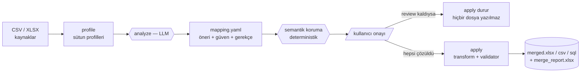

<div align="center">

# Schema Merger

**Dağınık CSV/Excel tablolarını, onayladığınız bir planla tek tabloda birleştirin.**

LLM yalnızca *öneri* üretir; birleştirmeyi siz onaylarsınız ve uygulama adımı tümüyle deterministiktir.

[](https://www.python.org/)
[](https://react.dev/)
[](https://fastapi.tiangolo.com/)
[](#-testler)
[](#-testler)
[](LICENSE)

[Ne işe yarar?](#-ne-işe-yarar) · [Hızlı başlangıç](#-hızlı-başlangıç) · [Nasıl çalışır](#-nasıl-çalışır) · [Web arayüzü](#-web-arayüzü) · [Dağıtım](#-dağıtım) · [Değişmez kararlar](#-değişmez-kararlar)

</div>

---

## 🧩 Ne işe yarar?

Elinizde aynı işi anlatan ama birbirini tutmayan tablolar var:

| `subeA_2023.csv` | `export_q4.csv` | `kasa_ozet.csv` |
| --- | --- | --- |
| `Ürün Adı` · `Adet` · `Birim Fiyat (TL)` | `item_name` · `qty` · `price_usd` | `PRD` · `MIKTAR` · `TUTAR` |
| `31.12.2024` · `12,50` | `2024-12-31` · `12.50` | `09.01.2025` · `20,00` |

Schema Merger bunları **tek bir hedef şemaya** göre alt alta birleştirir: sütun adlarını
eşleştirir, Türkçe/İngilizce sayı ve tarih biçimlerini normalize eder, her satırın nereden
geldiğini yazar — ve **onayınız olmadan hiçbir sütunu birleştirmez**.

> [!IMPORTANT]
> Bu bir "sihirli birleştirici" değil. Araç bir **plan** üretir, planı siz onaylarsınız,
> sonra plan harfiyen uygulanır. Onaylanmamış tek bir eşleştirme varsa birleştirme durur.

**Öne çıkanlar**

- 🔍 **Profil tabanlı eşleştirme** — LLM'e satır verisi değil, yalnızca sütun profilleri gider.
- ✋ **İnsan onayı zorunlu** — `review` durumundaki tek bir satır bile `apply`'ı durdurur.
- 🧾 **Provenance her zaman** — her satırda hangi dosya, hangi sütun bilgisi durur.
- 🛡️ **Üç koruma katmanı** — review-guard, semantik tuzak koruması ve validator.
- 🔗 **Entity resolution** — `Coca-Cola 33cl` ile `coca cola 0,33 lt`'yi aynı ürüne indirger.
- 🖥️ **CLI + Web** — ikisi de **aynı çekirdeği** kullanır; iş mantığı tek yerde.
- 🔑 **Kendi anahtarın** — web'de her kullanıcı kendi API anahtarını girer, anahtar diske yazılmaz.

---

## 🚀 Hızlı başlangıç

```bash
git clone https://github.com/Ediz-Ural/Schema_Merger.git
cd Schema_Merger
python -m venv .venv && .venv\Scripts\activate     # Windows (Linux/macOS: source .venv/bin/activate)
pip install -e ".[dev]" && pip install -e ".[openai]"
```

<table>
<tr><th width="50%">💻 Komut satırı</th><th width="50%">🖥️ Web arayüzü</th></tr>
<tr valign="top"><td>

```bash
# anahtarınızı .env dosyasına koyun
cp .env.example .env

# Faz 1 — plan üret (LLM burada)
merger analyze --inputs a.csv b.xlsx \
               --target-schema schema.yaml \
               --out mapping.yaml

# mapping.yaml'daki review satırlarını çözün

# Faz 2 — birleştir (LLM yok)
merger apply --mapping mapping.yaml \
             --out merged.xlsx --format xlsx
```

Anahtar `.env`'den okunur, repoya girmez.

</td><td>

```bash
pip install -e ".[web]"
uvicorn web.backend.main:app --reload   # :8000

cd web/frontend
npm install && npm run dev              # :5173
```

Tarayıcıda **http://localhost:5173** → hesap oluştur →
sağlayıcı rozetinden **kendi anahtarını ve modelini** gir →
dosyaları yükle → kartları onayla → indir.

</td></tr>
</table>

> Denemek için hazır veri: `tests/fixtures/live/` klasöründeki üç CSV ve `schema.yaml`
> — kasıtlı olarak tuzaklı hazırlanmıştır (farklı diller, kısaltmalar, TL/USD karışımı).

---

## ⚙️ Nasıl çalışır



**Faz 1 — `analyze` (LLM burada).** Her dosyanın sütunları profillenir: ad, tür, örnek
değerler, benzersiz sayısı, boş oranı, min/max, biçim ipuçları. LLM'e **yalnızca bu profiller**
gider; satır verisi hiçbir zaman sağlayıcıya çıkmaz. Sonuç, okunabilir bir plan dosyasıdır:

```yaml
- target_column: unit_price
  sources:
    - file: sales_2023.csv
      column: birim_fiyat
      confidence: 0.97
      status: auto              # auto | review | unmatched
      reason: "Ondalık örnekler örtüşüyor."
```

**Onay.** `auto` onaylı, `review` sizin kararınızı bekliyor, `unmatched` bilinçli olarak boş.
Web arayüzünde bunlar 🟢 / 🟡 / 🔴 kartlardır.

**Faz 2 — `apply` (LLM yok).** Aynı plan iki kez uygulanırsa aynı çıktı üretilir: dikey
(union/append) birleştirme, TR/EN sayı ve tarih normalizasyonu, provenance sütunları ve yanında
`merge_report.xlsx`.

<details>
<summary><b>Komutlar ve çıkış kodları</b></summary>

| Komut | Ne yapar | Anahtar ister mi? |
| --- | --- | --- |
| `merger profile --input a.csv` | Tek dosyayı profiller | ❌ |
| `merger analyze --inputs … --out mapping.yaml` | Plan üretir | ✅ |
| `merger cluster --mapping … --column …` | Entity kümeleri önerir | ✅ |
| `merger apply --mapping … --out merged.xlsx` | Deterministik birleştirir | ❌ |

`0` başarılı · `2` girdi/yapılandırma hatası (dosya yok, şema bozuk, anahtar yok, sağlayıcı
isteği reddetti) · `3` review-guard ya da validator birleştirmeyi durdurdu.

Sağlayıcı hataları (erişilmeyen model, geçersiz anahtar, hız sınırı, ağ) ham traceback olarak
değil, ne yapılacağını söyleyen tek satırlık bir mesaj olarak düşer.

</details>

---

## 🛡️ Üç koruma katmanı

| | Katman | Ne yapar |
| --- | --- | --- |
| 1️⃣ | **Review-guard** | Planda çözülmemiş tek bir `review` kalırsa `apply` **durur**, bekleyen satırları listeler ve **hiçbir çıktı yazmaz** (çıkış kodu `3`, API'de `409`). |
| 2️⃣ | **Semantik tuzak koruması** | Tip denetiminin göremediğini yakalar: satır **toplamının** birim fiyat sanılması, aynı hedef sütunun **TL ve USD**'den beslenmesi. Model ne kadar emin olursa olsun `review`'a düşer. |
| 3️⃣ | **Validator** | Yazmadan hemen önce, LLM'siz: tip uyuşmazlığı, eşlendiği hâlde boş kalan sütun, aykırı değer, `required` ihlali. Ciddi bulgu birleştirmeyi durdurur. |

<details>
<summary><b>Semantik tuzak koruması — ayrıntı</b></summary>

`analyze`, LLM önerdikten sonra **deterministik bir ikinci göz** çalıştırır
(`core/semantics.py`). Bu geçiş yalnızca **güveni düşürür** — bir eşleştirmeyi asla onaylamaz,
veriye dokunmaz:

- **Toplam ↔ birim.** Hedef birim başına bir değer beklerken kaynak sütun
  toplam/tutar/ara toplam/KDV gibi bir toplulaştırma ise (ya da tersi), eşleştirme `review`'a
  düşer. Örnek: `TUTAR` (2 × 10,00 = 20,00) → `unit_price`.
- **Para birimi çakışması.** Aynı hedef sütun farklı para birimlerinden besleniyorsa
  (`Birim Fiyat (TL)` ve `price_usd`, ya da örneklerdeki `₺`/`$` işaretleri) ilgili
  eşleştirmeler `review`'a düşer; dönüştürmeden birleştirmek değerleri karşılaştırılamaz kılar.

Aynı tuzaklar LLM'in sistem promptunda da yazılıdır; koruma, modelin kaçırdığı durumlar
için ağdır.

</details>

<details>
<summary><b>Validator — ayrıntı</b></summary>

Dört denetim yapılır:

- **tip** — hedef tür ile birleşik sütunun türü uyuşuyor mu; dönüştürülemeyen değerlerin oranı
  yüksekse (varsayılan %20) muhtemelen yanlış sütun eşleşmiştir.
- **null** — bir kaynak dosyada **eşlenmiş** olduğu hâlde boş kalan sütun. Sütunun hiç
  eşlenmediği dosyalardan gelen boşluklar plan gereği olduğu için sayılmaz. Eşik
  `--null-threshold` ile değişir (varsayılan `0.5`).
- **aykırı değer** — sayısal sütunlarda IQR×3 çiti, tarihlerde makul yıl aralığı.
- **required** — `required: true` hedef sütun eşlenmemişse ya da tek bir satırda bile boşsa hata.

`error` bulguları ilgili eşleştirmeyi `review`'a düşürür ve `apply`'ı durdurur; `warning`
bulguları durdurmaz, `merge_report.xlsx` → `Validation` sayfasına yazılır. Validator veriyi
hiçbir koşulda sessizce düzeltmez — yalnızca işaretler ve raporlar.

</details>

---

## 📄 Veri sözleşmeleri

Üç YAML dosyası araç ile kullanıcı arasındaki sözleşmedir; hepsi `core/contracts.py`
tarafından doğrulanır ve kayıpsız round-trip eder. Bozuk bir alan, satır numarasını ve
beklenen değeri söyleyen bir hata verir.

<details>
<summary><b><code>schema.yaml</code> — hedef şema (kullanıcı yazar)</b></summary>

```yaml
target_columns:
  - name: product_name      # hedef sütun adı
    type: string            # string | integer | decimal | date | boolean
    required: true          # true ise boş/eksik bırakılamaz (validator zorlar)
  - name: unit_price
    type: decimal
    required: true
output:
  format: xlsx              # xlsx | csv | sql
  add_provenance: true      # provenance sütunları eklensin mi (önerilen: true)
```

</details>

<details>
<summary><b><code>mapping.yaml</code> — plan (analyze yazar, kullanıcı onaylar)</b></summary>

Her hedef sütun için **her kaynak dosyadan bir** eşleştirme satırı bulunur.

```yaml
- target_column: unit_price
  sources:
    - file: sales_2023.csv  # kaynak dosya adı (taşınabilir olsun diye yol değil)
      column: birim_fiyat   # kaynak sütun; eşleşme yoksa null
      confidence: 0.97      # 0..1
      status: auto          # auto | review | unmatched
      reason: "Tür ve örnek değerler uyuşuyor."
```

- `auto` — onaylı; `apply` bu sütunu birleştirir.
- `review` — karar sizde; **tek bir `review` bile `apply`'ı durdurur**.
- `unmatched` — bilinçli olarak eşlenmedi; hedef sütun o dosyanın satırlarında boş kalır,
  satır atılmaz.

Onaylamak için `status`'u `auto` yapın (gerekirse `column`'u düzeltin); vazgeçmek için
`unmatched` yapıp `column: null` bırakın.

</details>

<details>
<summary><b><code>clusters.yaml</code> — entity kümeleri (cluster yazar, kullanıcı onaylar)</b></summary>

```yaml
- cluster_id: c001
  target_column: product_name
  canonical: Coca Cola 330ml     # members içindeki değerlerden biri olmalı
  status: review                 # auto | review | rejected
  members:
    - value: Coca Cola 330ml
      normalized: coca cola 330 ml
      row_count: 12
    - value: Coca-Cola 33cl
      normalized: coca cola 330 ml
      row_count: 3
  candidates:                    # onay bekleyen, henüz üye olmayan değerler
    - value: coca cola zero 330ml
      similarity: 0.86
      suggestion: undecided      # same | different | undecided
      source: llm                # embedding | llm
      confidence: 0.6
      reason: "Şeker içeriği farklı olabilir."
  reason: "Gri bölgede bir aday var."
```

- `status: auto` — küme onaylı; `apply` üyeleri canonical değere getirir.
- `status: review` — onaysız; **hiçbir üye birleştirilmez**, raporda "belirsiz" görünür.
- `status: rejected` — kullanıcı farklı ürün dedi; birleştirilmez, belirsiz de sayılmaz.

Bir adayı kabul etmek için `candidates`'tan `members`'a taşıyın; kümeyi bölmek için üyeyi
listeden çıkarıp yeni bir `cluster_id` ile ayrı küme yazın. Bir değer yalnızca tek bir kümenin
üyesi olabilir.

</details>

<details>
<summary><b>Provenance sütunları</b></summary>

`add_provenance: true` iken çıktıya eklenen sütunlar:

| Sütun | Anlamı |
| --- | --- |
| `_source_file` | Satırın geldiği dosya (çok sheet'te `dosya.xlsx#Sheet`) |
| `<hedef>_source_column` | O hedef sütunun bu satırdaki kaynak sütun adı |
| `_entity_cluster_id` | Satırın uygulandığı onaylı küme (entity resolution) |
| `<hedef>_original_value` | Canonical'e getirilmeden önceki yazım |
| `_merged_row_count` | Bu satırın temsil ettiği kaynak satır sayısı |

</details>

---

## 🔗 Entity resolution

Aynı ürünün farklı yazımlarını tek ürüne indirmek isteğe bağlı bir adımdır ve onaylı bir
`mapping.yaml` gerektirir:

```bash
merger cluster --mapping mapping.yaml --column product_name --out clusters.yaml
# (clusters.yaml düzenlenir: status auto/rejected, aday taşıma, bölme)
merger apply --mapping mapping.yaml --clusters clusters.yaml --out merged.xlsx
```

Sıra şudur: **normalizasyon → blocking → embedding + iki eşik → yalnızca gri bölge için LLM**.
Yüksek eşiğin üstü ve düşük eşiğin altı LLM'siz karara bağlanır; arada kalan az sayıda çift
LLM'e sorulur ve **her hâlde `review` kalır** — otomatik birleşme yoktur. Sütunun yalnızca
**farklı değerleri** karşılaştırılır, satır verisi sağlayıcıya gitmez.

Tekilleştirme yalnızca **entity çözümünün kendi yarattığı** yinelenmeleri siler: canonical
değere getirildikten sonra tüm hedef sütunlarda aynılaşan satırlar tek satıra iner. Aynı yazımın
gerçekten iki kez geçtiği satırlar (aynı ürünün iki ayrı satışı) korunur; hayatta kalan satır
`_entity_cluster_id`, `<sütun>_original_value` ve `_merged_row_count` ile provenance'ı taşır.

Embedding sağlayıcısı `EMBEDDING_PROVIDER` ile ayrı seçilir; `ollama` seçilirse karşılaştırılan
adlar makineden çıkmaz.

---

## 🖥️ Web arayüzü

CLI ile web **aynı çekirdeği** kullanır: `web/backend` yalnızca sunum ve orkestrasyon
katmanıdır, hiçbir iş mantığını ikinci kez yazmaz. Değişmez kararların hepsi API seviyesinde de
geçerlidir.

**Akış:** hesap oluştur → kendi anahtarını gir → dosyaları yükle → analiz → kartlarda onayla →
birleştir → indir.

| Kart | Durum | Anlamı |
| --- | --- | --- |
| 🟢 yeşil | `auto` | Otomatik eşleşti, onaylı. |
| 🟡 sarı | `review` | Karar sizde; **birleştirmeyi durdurur**. |
| 🔴 kırmızı | `unmatched` | Eşleşme yok; sütun seçin ya da boş bırakın. |

Her kartta hedef sütun, kaynak dosya, güven yüzdesi, gerekçe ve örnek değerler görünür.
Düzeltme dropdown iledir; seçenekler o dosyada **gerçekten var olan** sütunlardır, `(boş bırak)`
ise sütunu bilinçli olarak eşlememek demektir. **"Birleştir" butonu yalnızca hiç `review`
kalmadığında aktiftir**; backend aynı kuralı `409` ile uygular. Arayüz açık/koyu temayı işletim
sisteminden alır.

Ayrıntı ve dağıtım seçenekleri: [`web/frontend/README.md`](web/frontend/README.md).

<details>
<summary><b>HTTP uçları ve durum kodları</b></summary>

| Yöntem | Yol | Ne yapar |
|--------|-----|----------|
| `POST` | `/auth/register` | Hesap açar ve doğrudan oturum açar (`201`). |
| `POST` | `/auth/login` | Giriş yapar, `Bearer` token döndürür. |
| `POST` | `/auth/logout` | Oturumu kapatır; bellekteki anahtarı da unutur. |
| `GET` | `/auth/me` | Kim giriş yapmış, anahtarı tanımlı mı. |
| `GET` `PUT` `DELETE` | `/provider` | Kullanıcının sağlayıcı/model/anahtarı — **anahtar dönmez**. |
| `POST` | `/upload` | Kaynak dosyalar + `schema.yaml` yükler, oturum açar (`201`). |
| `POST` | `/analyze/{id}` | Faz 1: profil + LLM eşleştirme → plan döndürür. |
| `GET` `PUT` | `/mapping/{id}` | Planı getirir / kullanıcının onayladığı planı yazar. |
| `GET` | `/columns/{id}` | Kaynak dosyalardaki gerçek sütunlar (düzeltme dropdown'ı için). |
| `POST` | `/cluster/{id}` | Faz 1b: bir sütun için entity kümeleri önerir. |
| `GET` `PUT` | `/clusters/{id}` | Küme önerilerini getirir / onayları yazar. |
| `POST` | `/apply/{id}` | Faz 2: LLM'siz birleştirme; review varsa `409`. |
| `GET` | `/download/{id}/merged` · `/report` | `merged.<fmt>` ve `merge_report.xlsx`. |
| `GET` | `/status/{id}` | Oturumun hangi adımda olduğu. |
| `DELETE` | `/session/{id}` | Oturumu ve dosyalarını siler. |
| `GET` | `/health` | Ayakta mı? |

`400` bozuk şema/plan/istek · `401` giriş gerekli ya da oturum süresi doldu · `404` bilinmeyen
oturum, henüz üretilmemiş çıktı **ya da başkasının oturumu** · `409` review-guard veya
validator'ın durdurduğu `apply` · `502` sağlayıcı isteği reddetti (`llm_request_failed`) ·
`503` kullanıcının anahtarı yok (`llm_not_configured`).

Etkileşimli dokümantasyon: `http://127.0.0.1:8000/docs`.

</details>

<details>
<summary><b>Excel sheet davranışı</b></summary>

Çok sheet'li bir `.xlsx` dosyasında varsayılan olarak **tüm sheet'ler** taranır.
`--sheet <ad>` her komutta aynı anlama gelir: yalnızca o sheet okunur. Bayrak `.xlsx`
kaynaklara uygulanır, CSV kaynaklar etkilenmez — karışık bir çalıştırmayı bölmek gerekmez.

```bash
merger profile --input tests/fixtures/sample_multi_sheet.xlsx --sheet Stok
merger analyze --inputs kitap.xlsx --target-schema schema.yaml --out mapping.yaml --sheet Satis
merger apply --mapping mapping.yaml --out merged.csv --sheet Satis
```

`--sheet` verilmezse:

- **`profile`**: her sheet ayrı bir tablo profili olarak listelenir.
- **`analyze`**: dosyanın tüm sheet'lerindeki sütunlar o dosyanın aday sütunları sayılır.
- **`apply` / `cluster`**: sheet'ler **dikey olarak alt alta eklenir**. O dosya için eşlenmiş
  kaynak sütunlardan **hiçbirini içermeyen** bir sheet boş satır üretmemek için **atlanır**;
  atlananlar komut çıktısında ve `merge_report.xlsx` → `Summary` → `skipped_sheets` satırında
  listelenir.
- Bir sheet birden fazlaysa `_source_file` satırın geldiği sheet'i de yazar: `kitap.xlsx#Satis`.
- Eşlenmiş bir kaynak sütun dosyanın **hiçbir** sheet'inde yoksa `apply` hata verir (kod `2`);
  olmayan bir `--sheet` adı verilirse mevcut sheet adları listelenir.

</details>

---

## 🔐 Hesaplar, anahtarlar ve gizlilik

Anahtarlar **bize gitmez** ve hiçbir zaman kaynak koda yazılmaz. İki arayüzün anahtarı alma
biçimi farklıdır:

- **CLI:** anahtarınızı `.env` dosyasına girersiniz; `.env` `.gitignore` içinde ilk satırdadır.
- **Web:** her kullanıcı anahtarını arayüzden kendisi girer — açık bir kurulumda işletmecinin
  anahtarı harcanmaz.

Web tarafındaki her uç giriş ister (`Authorization: Bearer <token>`). Saklama farkı bilinçlidir:

| Ne | Nerede durur |
| --- | --- |
| Hesap (e-posta, parola **scrypt** özeti + tuz), sağlayıcı ve model seçimi | SQLite dosyası (`users.db`) |
| **API anahtarı** | Yalnızca sunucu sürecinin **belleğinde** |

> [!WARNING]
> Anahtar hiçbir koşulda veritabanına, oturum klasörüne ya da loga yazılmaz; `GET /provider` ve
> `GET /auth/me` yalnızca sağlayıcıyı, modeli ve anahtarın tanımlı olup olmadığını bildirir —
> maskelenmiş hâli bile dönmez. Çıkışta ve sunucu yeniden başladığında anahtar unutulur; bu,
> "diske yazmama" sözünün kasıtlı bedelidir. Tarayıcıda yalnızca oturum token'ı saklanır.

Parolalar `hashlib.scrypt` ile (kullanıcıya özel tuz, `n=2^14`) özetlenir; aynı adrese art arda
başarısız girişler kısa süreli yavaşlatılır. Başkasının oturumu `403` değil `404` döner — API,
görmemesi gereken bir kimliğin varlığını doğrulamaz.

`profile` ve `apply` hiçbir koşulda anahtar istemez — Faz 2 tamamen deterministiktir.

Katkı verirken commit öncesi bir sızıntı taraması önerilir:
[`gitleaks`](https://github.com/gitleaks/gitleaks) ya da `git-secrets`'i bir `pre-commit`
kancasına bağlayın.

---

## 🌍 Dağıtım

**1. Ortam değişkenleri**

| Değişken | Ne işe yarar | Varsayılan |
| --- | --- | --- |
| `SCHEMA_MERGER_WEB_ROOT` | Oturum klasörlerinin kökü | geçici klasör |
| `SCHEMA_MERGER_DB` | Hesap veritabanının yolu | `<web root>/users.db` |
| `SCHEMA_MERGER_CORS_ORIGINS` | İzinli tarayıcı kaynakları | `http://localhost:5173` |
| `LLM_PROVIDER` / `OPENAI_API_KEY` | Yalnızca **CLI** için | — |

İlk ikisi verilmezse hesaplar ve oturumlar yalnızca o çalıştırma boyunca yaşar; kalıcı bir
kurulumda ikisini de verin.

**2. Tek süreç**

Oturumlar ve kullanıcıların anahtarları yalnızca sürecin belleğinde tutulur (anahtarın diske
yazılmamasının bedeli). Bu yüzden uygulama tek işçiyle çalışır ve birden fazla işçi
istendiğinde sessizce yanlış davranmak yerine **açılışta net bir hatayla durur**:

```bash
uvicorn web.backend.main:app --host 0.0.0.0 --port 8000 --proxy-headers   # çalışır
uvicorn web.backend.main:app --workers 4                                  # açılışta durur
```

Paylaşımlı bir oturum/anahtar deposu ekleyip bilinçli devam ediyorsanız
`SCHEMA_MERGER_ALLOW_MULTIPROCESS=1` verin.

**3. TLS sonlandıran bir proxy**

Oturum token'ı ve API anahtarı isteklerde taşındığı için uygulama HTTPS arkasında durmalıdır.
[Caddy](https://caddyserver.com/) ile birkaç satır yeter (sertifikayı kendisi alır):

```caddy
merger.example.com {
    root * /srv/schema-merger/web/frontend/dist
    handle /api/* {
        uri strip_prefix /api
        reverse_proxy 127.0.0.1:8000
    }
    file_server
}
```

Frontend'i `npm run build` ile derleyin (gerekirse `VITE_API_BASE=/api`) ve
`SCHEMA_MERGER_CORS_ORIGINS`'i kendi alan adınıza daraltın.

---

## 🧪 Testler

```bash
pytest                                   # çekirdek + CLI + web backend (ağa çıkmaz)
cd web/frontend && npm test              # React arayüzü (vitest)

SCHEMA_MERGER_LIVE=1 pytest -m live      # gerçek sağlayıcıya isabet testleri (ücretli)
```

| Paket | Sayı | Ne doğrular |
| --- | --- | --- |
| `pytest` | 235 | Çekirdek, CLI, web backend; satır kapsamı **%90** |
| `vitest` | 22 | Kartlar, review-guard, giriş akışı, anahtarın tarayıcıda kalmaması |
| `pytest -m live` | 7 | Gerçek modelin doğru sütunu seçmesi |

Testler ağa çıkmaz: LLM ve embedding sağlayıcıları `FakeLLMClient` / `FakeEmbeddingClient` ile
enjekte edilir, `apply` tarafında ise bir istemcinin kurulmadığı ayrıca test edilir.

`tests/live/` altındaki **isabet testleri** varsayılan koşuda hariç tutulur ve yapılandırılmış
gerçek sağlayıcıya gider: diller/kısaltmalar arası eşleşme, olmayan sütunun uydurulmaması,
toplam sütununun birim fiyata onaysız girmemesi, iki para biriminin sessizce birleşmemesi ve
gerçek embedding'lerle ürün kümeleme. Model ifadeleri değil, yalnızca kararlar denetlenir.

---

## 🧭 Kenar durumlar

<details>
<summary><b>Çakışan değerler · tip çatışmaları · eksik anahtar · bozuk girdi</b></summary>

**Çakışan değerler.** İki dosya aynı ürün için farklı fiyat söylüyorsa **iki satır da
korunur**; hangisinin "doğru" olduğu otomatik seçilmez (kapsam dışı). Fark provenance ile
izlenir: `_source_file` ve `<hedef>_source_column` her satırda kaynağı yazar,
`merge_report.xlsx` → `Columns` sayfası aynı bilgiyi sütun bazında verir.

**Tip çatışmaları.** Değerler hedef türe TR/EN normalizasyonuyla çevrilir (`12,50` ve `12.50`
→ `12.5`; `31.12.2024`, `31/12/2024`, `2024-12-31` → tarih). Çevrilemeyen bir değer **sessizce
silinmez**: hücre null olur, satır kalır, hata `merge_report` sayaçlarına yazılır ve komut
çıktısında görünür. Oran validator eşiğini aşarsa eşleştirme `review`'a düşer ve `apply` durur.

**API anahtarı yok.** `analyze` ve `cluster` bir sağlayıcı ister. Anahtar yoksa komut hiçbir
dosya yazmadan durur ve eksik değişkeni adıyla söyler:

```
$ merger analyze --inputs sales.csv --target-schema schema.yaml --out mapping.yaml
Error: OPENAI_API_KEY tanımlı değil, .env dosyanı kontrol et.
```

(`LLM_PROVIDER=anthropic` ise `ANTHROPIC_API_KEY`; `ollama` yerel çalıştığı için anahtar
istemez.)

**Boş / bulunamayan girdi.** Olmayan dosya, desteklenmeyen uzantı (`.csv` ve `.xlsx` dışı),
eksik hedef şema ve mapping'de adı geçip diskte olmayan kaynak, çıkış kodu `2` ile ve ne
yapılacağını söyleyen bir mesajla bildirilir.

</details>

---

## 📜 Değişmez kararlar

> Projenin tasarım kararları; hepsi kodda ve testlerde korunur.

1. **Yalnızca dikey birleştirme** (union/append). Yatay join kapsam dışıdır.
2. **`analyze` → kullanıcı onayı → `apply`** iki fazlı akış; tek adımda birleştirme yok.
3. **LLM satır verisini işlemez.** LLM'e yalnızca sütun profilleri, entity adımında ise sütunun
   farklı değerleri gider.
4. Her eşleştirme **confidence + status + gerekçe** taşır.
5. Planda çözülmemiş **`review` kalırsa `apply` durur** ve hiçbir çıktı yazmaz.
6. **Provenance her zaman** yazılır: hangi satır hangi dosya ve sütundan geldi.
7. **API anahtarı asla repoya girmez**: CLI'da `.env` ile verilir, web'de her kullanıcı kendi
   anahtarını girer ve anahtar yalnızca sunucu belleğinde tutulur, yanıtlarda dönmez.
8. Önce **çekirdek + CLI**; UI daha sonra **aynı çekirdeği** kullanır.

---

## 📌 Kapsam

**Hazır:** profil → plan → onay → deterministik birleştirme → rapor; validator ve semantik
tuzak koruması; entity resolution (normalizasyon → blocking → embedding → gri bölge LLM → küme
onayı → tekilleştirme); çok kullanıcılı web arayüzü (hesap, kullanıcı başına anahtar/model,
kart tabanlı onay ekranı, koyu tema).

**Kapsam dışı:** yatay join, canlı veritabanları ve SQL dump'ları, `.csv`/`.xlsx` dışındaki
girdi biçimleri, çakışan değerler arasında otomatik seçim.

---

<div align="center">

**MIT lisanslı** — bkz. [LICENSE](LICENSE)

</div>
