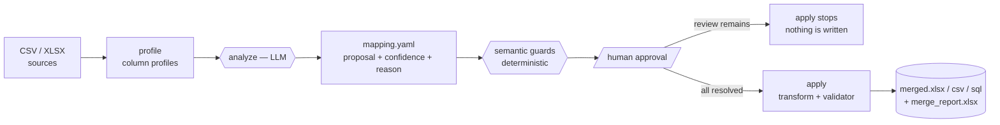

<div align="center">

# Schema Merger

**Merge messy CSV/Excel tables into one clean table — from a plan you approve.**

The LLM only *proposes*. You approve the plan, and the step that touches your data is fully deterministic.

[](https://www.python.org/)
[](https://react.dev/)
[](https://fastapi.tiangolo.com/)
[](#-tests)
[](#-tests)
[](LICENSE)

[What it does](#-what-it-does) · [Quick start](#-quick-start) · [How it works](#-how-it-works) · [Web UI](#-web-ui) · [Deployment](#-deployment) · [Invariants](#-invariants)

</div>

> **Note on language.** This documentation is in English; the CLI output and the web
> interface speak Turkish, as do the reasons written into `mapping.yaml`.

---

## 🧩 What it does

You have tables that describe the same thing but agree on nothing:

| `branch_a_2023.csv` | `export_q4.csv` | `register_summary.csv` |
| --- | --- | --- |
| `Ürün Adı` · `Adet` · `Birim Fiyat (TL)` | `item_name` · `qty` · `price_usd` | `PRD` · `MIKTAR` · `TUTAR` |
| `31.12.2024` · `12,50` | `2024-12-31` · `12.50` | `09.01.2025` · `20,00` |

Schema Merger appends them into **one target schema**: it matches column names, normalises
Turkish/English number and date formats, records where every row came from — and **merges
nothing without your approval**.

> [!IMPORTANT]
> This is not a magic merger. The tool produces a **plan**, you approve the plan, and then the
> plan is applied to the letter. If a single match is still unapproved, the merge stops.

**Highlights**

- 🔍 **Profile-based matching** — the LLM sees column profiles, never your rows.
- ✋ **Human approval required** — one match left in `review` stops `apply`.
- 🧾 **Provenance always** — every row carries the file and column it came from.
- 🛡️ **Three guard layers** — the review guard, semantic trap guards, and the validator.
- 🔗 **Entity resolution** — folds `Coca-Cola 33cl` and `coca cola 0,33 lt` into one product.
- 🖥️ **CLI + Web** — both drive the **same core**; the logic lives in exactly one place.
- 🔑 **Bring your own key** — each web user enters their own API key, and it never touches disk.

---

## 🚀 Quick start

```bash
git clone https://github.com/Ediz-Ural/Schema_Merger.git
cd Schema_Merger
python -m venv .venv && .venv\Scripts\activate     # Windows (Linux/macOS: source .venv/bin/activate)
pip install -e ".[dev]" && pip install -e ".[openai]"
```

<table>
<tr><th width="50%">💻 Command line</th><th width="50%">🖥️ Web interface</th></tr>
<tr valign="top"><td>

```bash
# put your key in .env
cp .env.example .env

# Phase 1 — produce a plan (the LLM runs here)
merger analyze --inputs a.csv b.xlsx \
               --target-schema schema.yaml \
               --out mapping.yaml

# resolve the review rows in mapping.yaml

# Phase 2 — merge (no LLM)
merger apply --mapping mapping.yaml \
             --out merged.xlsx --format xlsx
```

The key is read from `.env` and never enters the repository.

</td><td>

```bash
pip install -e ".[web]"
uvicorn web.backend.main:app --reload   # :8000

cd web/frontend
npm install && npm run dev              # :5173
```

Open **http://localhost:5173** → create an account →
enter **your own key and model** from the provider chip →
upload files → approve the cards → download.

</td></tr>
</table>

> Ready-made sample data: the three CSVs and `schema.yaml` under `tests/fixtures/live/`
> — deliberately full of traps (different languages, abbreviations, mixed TRY/USD).

---

## ⚙️ How it works



**Phase 1 — `analyze` (the LLM runs here).** Every file's columns are profiled: name, type,
sample values, distinct count, null ratio, min/max, format hints. **Only those profiles** go to
the model; row data never leaves for a provider. The result is a readable plan file:

```yaml
- target_column: unit_price
  sources:
    - file: sales_2023.csv
      column: birim_fiyat
      confidence: 0.97
      status: auto              # auto | review | unmatched
      reason: "Ondalık örnekler örtüşüyor."
```

**Approval.** `auto` is settled, `review` waits for your decision, `unmatched` is deliberately
empty. In the web UI these are 🟢 / 🟡 / 🔴 cards.

**Phase 2 — `apply` (no LLM).** Applying the same plan twice produces the same output: a
vertical (union/append) merge, Turkish/English number and date normalisation, provenance
columns, and `merge_report.xlsx` alongside the result.

<details>
<summary><b>Commands and exit codes</b></summary>

| Command | What it does | Needs a key? |
| --- | --- | --- |
| `merger profile --input a.csv` | Profiles one file | ❌ |
| `merger analyze --inputs … --out mapping.yaml` | Produces a plan | ✅ |
| `merger cluster --mapping … --column …` | Proposes entity clusters | ✅ |
| `merger apply --mapping … --out merged.xlsx` | Merges deterministically | ❌ |

`0` success · `2` input or configuration error (missing file, broken schema, no key, provider
refused the request) · `3` the review guard or the validator stopped the merge.

Provider failures (a model you cannot reach, an invalid key, a rate limit, a network problem)
arrive as a single line that says what to do — never as a raw traceback.

</details>

---

## 🛡️ Three guard layers

| | Layer | What it does |
| --- | --- | --- |
| 1️⃣ | **Review guard** | If one unresolved `review` remains, `apply` **stops**, lists the pending rows and **writes nothing** (exit code `3`, HTTP `409`). |
| 2️⃣ | **Semantic trap guards** | Catches what a type check cannot see: a line **total** taken for a unit price, one target column fed by **TRY and USD**. However confident the model is, the match drops to `review`. |
| 3️⃣ | **Validator** | Just before writing, with no LLM: type mismatch, a column mapped yet left empty, outliers, `required` violations. A serious finding stops the merge. |

<details>
<summary><b>Semantic trap guards — detail</b></summary>

After the LLM proposes, `analyze` runs a **deterministic second opinion**
(`core/semantics.py`). That pass may only **lower** trust — it never approves a match and never
touches data:

- **Total ↔ per-unit.** When the target expects a per-item value and the source column is an
  aggregate (total, amount, subtotal, VAT) — or the other way round — the match drops to
  `review`. Example: `TUTAR` (2 × 10,00 = 20,00) → `unit_price`.
- **Currency conflict.** When one target column is fed by different currencies
  (`Birim Fiyat (TL)` and `price_usd`, or `₺`/`$` in the samples), those matches drop to
  `review`: merging them without conversion makes the values incomparable.

The same traps are spelled out in the LLM's system prompt, so the model usually lowers its own
confidence; the guard is the net for the cases it misses.

</details>

<details>
<summary><b>Validator — detail</b></summary>

Four checks run:

- **type** — does the target type match the merged column? A high share of unconvertible values
  (20% by default) usually means the wrong column was matched.
- **null** — a column that is **mapped** in a source file yet stays empty. Blanks from files
  where the column was never mapped are by design and are not counted. The threshold is
  `--null-threshold` (default `0.5`).
- **outlier** — an IQR×3 fence on numeric columns, a plausible year range on dates.
- **required** — an error when a `required: true` target column is unmapped or empty in even a
  single row.

`error` findings push the match back to `review` and stop `apply`; `warning` findings do not
stop it and are written to the `Validation` sheet of `merge_report.xlsx`. The validator never
silently fixes data — it flags and reports.

</details>

---

## 📄 Data contracts

Three YAML files are the contract between the tool and you. All of them are validated by
`core/contracts.py` and round-trip without loss; a malformed field produces an error naming the
line and the expected value.

<details>
<summary><b><code>schema.yaml</code> — the target schema (you write it)</b></summary>

```yaml
target_columns:
  - name: product_name      # target column name
    type: string            # string | integer | decimal | date | boolean
    required: true          # when true it cannot be missing or empty (enforced by the validator)
  - name: unit_price
    type: decimal
    required: true
output:
  format: xlsx              # xlsx | csv | sql
  add_provenance: true      # write provenance columns (recommended: true)
```

</details>

<details>
<summary><b><code>mapping.yaml</code> — the plan (analyze writes it, you approve it)</b></summary>

There is one match row per target column **per source file**.

```yaml
- target_column: unit_price
  sources:
    - file: sales_2023.csv  # file name, not a path, so the plan stays portable
      column: birim_fiyat   # source column; null when there is no match
      confidence: 0.97      # 0..1
      status: auto          # auto | review | unmatched
      reason: "Tür ve örnek değerler uyuşuyor."
```

- `auto` — approved; `apply` merges this column.
- `review` — your call; **a single `review` stops `apply`**.
- `unmatched` — deliberately not matched; the target column stays empty for that file's rows
  and no row is dropped.

To approve, set `status` to `auto` (fixing `column` if needed); to decline, set `unmatched` and
leave `column: null`.

</details>

<details>
<summary><b><code>clusters.yaml</code> — entity clusters (cluster writes them, you approve them)</b></summary>

```yaml
- cluster_id: c001
  target_column: product_name
  canonical: Coca Cola 330ml     # must be one of the member values
  status: review                 # auto | review | rejected
  members:
    - value: Coca Cola 330ml
      normalized: coca cola 330 ml
      row_count: 12
    - value: Coca-Cola 33cl
      normalized: coca cola 330 ml
      row_count: 3
  candidates:                    # proposed spellings, not members yet
    - value: coca cola zero 330ml
      similarity: 0.86
      suggestion: undecided      # same | different | undecided
      source: llm                # embedding | llm
      confidence: 0.6
      reason: "Şeker içeriği farklı olabilir."
  reason: "Gri bölgede bir aday var."
```

- `status: auto` — approved; `apply` rewrites the members to the canonical value.
- `status: review` — unapproved; **no member is merged**, and the report lists it as pending.
- `status: rejected` — you said these are different products; not merged, not pending either.

To accept a candidate, move it from `candidates` to `members`; to split a cluster, remove the
member and write it as a separate cluster with a new `cluster_id`. A value may belong to only
one cluster.

</details>

<details>
<summary><b>Provenance columns</b></summary>

Written when `add_provenance: true`:

| Column | Meaning |
| --- | --- |
| `_source_file` | The file the row came from (`book.xlsx#Sheet` for workbooks) |
| `<target>_source_column` | The source column behind that target column, per row |
| `_entity_cluster_id` | The approved cluster applied to this row (entity resolution) |
| `<target>_original_value` | The spelling before it was rewritten to the canonical value |
| `_merged_row_count` | How many source rows this row represents |

</details>

---

## 🔗 Entity resolution

Folding different spellings of one product into a single value is an optional step and requires
an approved `mapping.yaml`:

```bash
merger cluster --mapping mapping.yaml --column product_name --out clusters.yaml
# (edit clusters.yaml: status auto/rejected, move candidates, split clusters)
merger apply --mapping mapping.yaml --clusters clusters.yaml --out merged.xlsx
```

The order is: **normalisation → blocking → embeddings with two thresholds → the LLM for the
grey zone only**. Everything above the high threshold and below the low one is decided without
an LLM; the few pairs in between are asked, and the cluster **stays in `review` either way** —
nothing merges automatically. Only the column's **distinct values** are compared, so row data
never reaches a provider.

Deduplication removes only the duplicates **entity resolution itself created**: rows that become
identical across every target column once the canonical value is applied. Rows where the same
spelling genuinely occurs twice (two separate sales of one product) are kept, and the surviving
row carries `_entity_cluster_id`, `<column>_original_value` and `_merged_row_count`.

The embedding provider is chosen separately with `EMBEDDING_PROVIDER`; pick `ollama` and the
compared names never leave your machine.

---

## 🖥️ Web UI

The CLI and the web app drive the **same core**: `web/backend` is presentation and
orchestration only and never writes a business rule twice. Every invariant holds at the API
level too.

**Flow:** create an account → enter your key → upload files → analyze → approve the cards →
merge → download.

| Card | Status | Meaning |
| --- | --- | --- |
| 🟢 green | `auto` | Matched automatically, approved. |
| 🟡 amber | `review` | Your call; **it blocks the merge**. |
| 🔴 red | `unmatched` | No match; pick a column or leave it empty. |

Each card shows the target column, the source file, the confidence, the reason and sample
values. Corrections are made from a dropdown whose options are the columns that **actually
exist** in that file; `(boş bırak)` means deliberately leaving it unmatched. **The merge button
is enabled only when no `review` remains**, and the backend enforces the same rule with `409`.
The interface follows your system's light/dark theme.

More detail and deployment options: [`web/frontend/README.md`](web/frontend/README.md).

<details>
<summary><b>HTTP endpoints and status codes</b></summary>

| Method | Path | What it does |
|--------|------|--------------|
| `POST` | `/auth/register` | Creates an account and signs it in (`201`). |
| `POST` | `/auth/login` | Signs in and returns a `Bearer` token. |
| `POST` | `/auth/logout` | Signs out; forgets the in-memory key too. |
| `GET` | `/auth/me` | Who is signed in, and whether their key is held. |
| `GET` `PUT` `DELETE` | `/provider` | The user's provider/model/key — **the key is never returned**. |
| `POST` | `/upload` | Uploads sources + `schema.yaml` and opens a session (`201`). |
| `POST` | `/analyze/{id}` | Phase 1: profiles + LLM matching → the plan. |
| `GET` `PUT` | `/mapping/{id}` | Reads the plan / stores the approved plan. |
| `GET` | `/columns/{id}` | The columns that exist in the sources (for the dropdown). |
| `POST` | `/cluster/{id}` | Phase 1b: proposes entity clusters for one column. |
| `GET` `PUT` | `/clusters/{id}` | Reads cluster proposals / stores approvals. |
| `POST` | `/apply/{id}` | Phase 2: the LLM-free merge; `409` while a review remains. |
| `GET` | `/download/{id}/merged` · `/report` | `merged.<fmt>` and `merge_report.xlsx`. |
| `GET` | `/status/{id}` | Which step the session is on. |
| `DELETE` | `/session/{id}` | Deletes the session and its files. |
| `GET` | `/health` | Is it up? |

`400` malformed schema/plan/request · `401` sign-in required or session expired · `404` unknown
session, an artifact that does not exist yet, **or someone else's session** · `409` an `apply`
stopped by the review guard or the validator · `502` the provider refused the request
(`llm_request_failed`) · `503` this user has no key (`llm_not_configured`).

Interactive documentation: `http://127.0.0.1:8000/docs`.

</details>

<details>
<summary><b>Excel sheet behaviour</b></summary>

In a multi-sheet `.xlsx` file **every sheet** is read by default. `--sheet <name>` means the
same thing in every command: read only that sheet. The flag applies to `.xlsx` sources and
leaves CSV sources alone, so a mixed run does not need splitting.

```bash
merger profile --input tests/fixtures/sample_multi_sheet.xlsx --sheet Stok
merger analyze --inputs book.xlsx --target-schema schema.yaml --out mapping.yaml --sheet Satis
merger apply --mapping mapping.yaml --out merged.csv --sheet Satis
```

Without `--sheet`:

- **`profile`**: every sheet is listed as its own table profile.
- **`analyze`**: the columns of all sheets count as that file's candidates.
- **`apply` / `cluster`**: sheets are **appended vertically**. A sheet that contains **none** of
  the mapped source columns for that file is **skipped** so it cannot produce empty rows;
  skipped sheets are listed in the command output and in `merge_report.xlsx` → `Summary` →
  `skipped_sheets`.
- When more than one sheet is read, `_source_file` records it too: `book.xlsx#Satis`.
- If a mapped source column exists in **no** sheet of the file, `apply` fails (exit code `2`);
  an unknown `--sheet` name lists the sheets that do exist.

</details>

---

## 🔐 Accounts, keys and privacy

Keys **never come to us** and are never written into source code. The two interfaces take a key
differently:

- **CLI:** you put your key in `.env`, which is the first line of `.gitignore`.
- **Web:** each user enters their own key in the interface — a public instance never spends the
  operator's key.

Every web endpoint requires a sign-in (`Authorization: Bearer <token>`). The storage split is
deliberate:

| What | Where it lives |
| --- | --- |
| The account (e-mail, **scrypt** password hash + salt), provider and model choice | A SQLite file (`users.db`) |
| **The API key** | Only in the server process's **memory** |

> [!WARNING]
> The key is never written to the database, a session workspace or a log line. `GET /provider`
> and `GET /auth/me` report only the provider, the model and whether a key is held — not even a
> masked form of it. Signing out or restarting the server forgets it; that is the deliberate
> price of the "never on disk" promise. The browser stores only the session token.

Passwords are hashed with `hashlib.scrypt` (per-user salt, `n=2^14`), and repeated failed
sign-ins for one address are briefly slowed down. Someone else's session answers `404`, not
`403` — the API never confirms that an id it should not show you exists.

`profile` and `apply` never ask for a key — Phase 2 is fully deterministic.

A secret scan before committing is recommended for contributors: hook
[`gitleaks`](https://github.com/gitleaks/gitleaks) or `git-secrets` into `pre-commit`.

---

## 🌍 Deployment

**1. Environment variables**

| Variable | Purpose | Default |
| --- | --- | --- |
| `SCHEMA_MERGER_WEB_ROOT` | Root for session workspaces | a temporary folder |
| `SCHEMA_MERGER_DB` | Path to the accounts database | `<web root>/users.db` |
| `SCHEMA_MERGER_CORS_ORIGINS` | Allowed browser origins | `http://localhost:5173` |
| `LLM_PROVIDER` / `OPENAI_API_KEY` | For the **CLI** only | — |

Without the first two, accounts and sessions live only for that run; set both for a persistent
installation.

**2. A single process**

Sessions and each user's key live only in the process's memory (the price of never writing a
key to disk). The application therefore runs with one worker, and when more are requested it
**stops at startup with a clear error** instead of misbehaving silently:

```bash
uvicorn web.backend.main:app --host 0.0.0.0 --port 8000 --proxy-headers   # works
uvicorn web.backend.main:app --workers 4                                  # stops at startup
```

If you have added a shared session/key store and want to proceed deliberately, set
`SCHEMA_MERGER_ALLOW_MULTIPROCESS=1`.

**3. A TLS-terminating proxy**

The session token and the API key travel in requests, so the app belongs behind HTTPS. A few
lines of [Caddy](https://caddyserver.com/) are enough (it obtains the certificate itself):

```caddy
merger.example.com {
    root * /srv/schema-merger/web/frontend/dist
    handle /api/* {
        uri strip_prefix /api
        reverse_proxy 127.0.0.1:8000
    }
    file_server
}
```

Build the frontend with `npm run build` (set `VITE_API_BASE=/api` if needed) and narrow
`SCHEMA_MERGER_CORS_ORIGINS` to your own domain.

---

## 🧪 Tests

```bash
pytest                                   # core + CLI + web backend (never hits the network)
cd web/frontend && npm test              # the React interface (vitest)

SCHEMA_MERGER_LIVE=1 pytest -m live      # accuracy tests against a real provider (paid)
```

| Suite | Count | What it proves |
| --- | --- | --- |
| `pytest` | 235 | Core, CLI, web backend; **90%** line coverage |
| `vitest` | 22 | Cards, the review guard, the sign-in flow, the key never staying in the browser |
| `pytest -m live` | 7 | That a real model picks the right column |

The suites never reach the network: LLM and embedding providers are injected as
`FakeLLMClient` / `FakeEmbeddingClient`, and `apply` is separately tested for building no client
at all.

The **accuracy tests** under `tests/live/` are excluded from the default run and go to your
configured provider: matching across languages and abbreviations, not inventing a column that
does not exist, a total never entering a unit price unreviewed, two currencies never merging
silently, and product clustering with real embeddings. They assert decisions, never wording.

---

## 🧭 Edge cases

<details>
<summary><b>Conflicting values · type conflicts · missing key · broken input</b></summary>

**Conflicting values.** When two files give different prices for the same product, **both rows
are kept**; which one is "right" is not chosen automatically (out of scope). The difference is
traceable through provenance: `_source_file` and `<target>_source_column` name the source on
every row, and `merge_report.xlsx` → `Columns` gives the same per column.

**Type conflicts.** Values are converted to the target type with Turkish/English normalisation
(`12,50` and `12.50` → `12.5`; `31.12.2024`, `31/12/2024`, `2024-12-31` → a date). A value that
cannot be converted is **never silently dropped**: the cell becomes null, the row stays, and the
error is counted in `merge_report` and shown in the command output. If the share crosses the
validator's threshold, the match falls back to `review` and `apply` stops.

**No API key.** `analyze` and `cluster` need a provider. Without a key the command stops before
writing anything and names the missing variable:

```
$ merger analyze --inputs sales.csv --target-schema schema.yaml --out mapping.yaml
Error: OPENAI_API_KEY tanımlı değil, .env dosyanı kontrol et.
```

(`ANTHROPIC_API_KEY` when `LLM_PROVIDER=anthropic`; `ollama` runs locally and needs no key.)

**Empty or missing input.** A missing file, an unsupported extension (anything but `.csv` and
`.xlsx`), a missing target schema, and a source named in the plan but absent from disk are all
reported with exit code `2` and a message that says what to do.

</details>

---

## 📜 Invariants

> The project's design decisions; every one of them is held by code and tests.

1. **Vertical merges only** (union/append). Horizontal joins are out of scope.
2. **`analyze` → human approval → `apply`**; there is no one-step merge.
3. **The LLM never processes rows.** It receives column profiles, and in the entity step the
   distinct values of one column.
4. Every match carries **confidence + status + a reason**.
5. If an unresolved **`review` remains, `apply` stops** and writes nothing.
6. **Provenance is always written**: which row came from which file and column.
7. **An API key never enters the repository**: the CLI takes it from `.env`, and on the web each
   user enters their own, which is held in server memory only and never returned.
8. **Core and CLI first**; the UI came later and drives the **same core**.

---

## 📌 Scope

**Done:** profile → plan → approval → deterministic merge → report; the validator and the
semantic trap guards; entity resolution (normalisation → blocking → embeddings → grey-zone LLM
→ cluster approval → deduplication); a multi-user web interface (accounts, per-user key and
model, card-based approval screen, dark theme).

**Out of scope:** horizontal joins, live databases and SQL dumps, input formats other than
`.csv`/`.xlsx`, and choosing automatically between conflicting values.

---

<div align="center">

**MIT licensed** — see [LICENSE](LICENSE)

</div>
